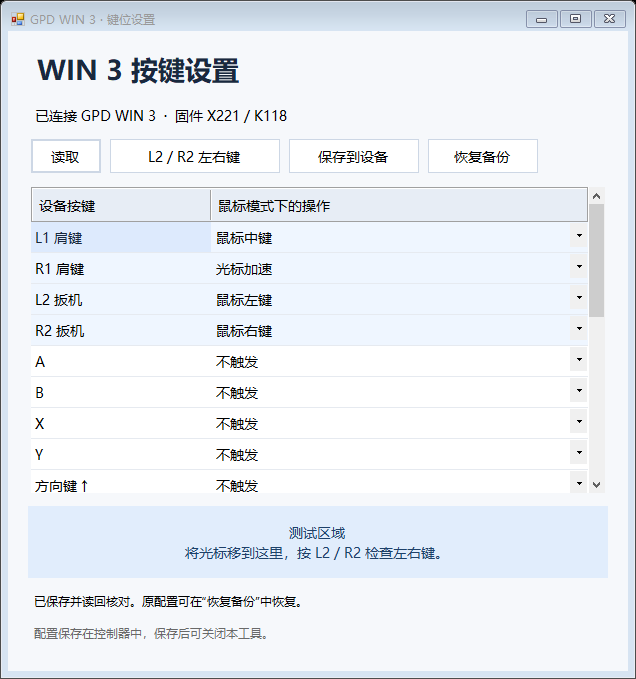

# GPD WIN 3 Keymapper

为 **GPD WIN 3 键盘鼠标模式**设计的便携按键设置工具。支持把鼠标左右键改到 L2 / R2，提供自定义映射、自动备份和恢复。

[下载 v1.0.0 便携版](https://github.com/SuperHuzifei/gpd-win3-keymapper/raw/refs/heads/main/GPD-WIN3-Keymapper-v1.0.0.zip)



## 功能

- 调整 L1、R1、L2、R2，以及方向键、ABXY、左摇杆方向、摇杆按下和 Start / Select / Menu 的鼠标模式映射。
- 可选择鼠标左右中键、滚轮、光标加速或单个键盘按键。
- 一键填入下列肩键互换方案，再点击“保存到设备”应用。
- 保存前自动备份完整配置，保存后读取并逐字节核对。
- 设置保存在控制器中，关闭软件后仍然有效，无需后台常驻。

| 设备按键 | 互换预设 |
| --- | --- |
| L2 | 鼠标左键 |
| R2 | 鼠标右键 |
| L1 | 鼠标中键 |
| R1 | 光标加速 |

## 支持范围

目前只允许在已验证组合上写入：

- **GPD WIN 3，型号 `G1618-03`**
- **控制器固件 `X221 / K118`**，即原工具中的版本字节标识
- 已在 Windows 10 22H2 x64 上验证；运行依赖 Windows 自带的 .NET Framework 4.x

硬件测试已确认肩键互换后的左键、右键、中键和光标加速全部正常。其他型号或固件版本不会开放写入按钮。

配置通过标准 Windows USB HID 接口读写，不使用 RwDrv / WinRing0，不安装额外内核驱动，不调整 TDP 或电压，也不升级固件程序。编辑的是键盘鼠标模式配置，不改变手柄模式的 XInput 布局。

后背宏按键和右摇杆光标移动不在本版编辑范围内。未编辑的配置字节原样保留。

## 使用方法

1. 下载 ZIP，解压到可写目录，运行 `GPD-WIN3-Keymapper.exe`。
2. 程序自动读取当前配置；可以选择各按键对应的操作。
3. 点击 **“L2 / R2 左右键”** 填入互换方案，再点击 **“保存到设备”**。
4. 将光标放到蓝色测试区域，检查点击和松开；按住 R1 移动摇杆检查加速。
5. 原始配置保存在 `backups/original.gpdmap`；点击 **“恢复备份”** 选择它即可恢复。之后每次更改也会生成独立备份。

如果按键未立即反映保存后的配置，可把机身开关切到手柄模式，再切回键盘鼠标模式测试。

下载包从空配置备份目录开始；首次保存时会备份使用者自己的设备设置。

## 从源码构建

在 Windows x64 上运行：

```powershell
./build.ps1
```

输出位于 `dist/GPD-WIN3-Keymapper.exe`。脚本使用 Windows 自带的 .NET Framework C# 编译器，无需安装额外 NuGet 包。

运行不访问硬件的检查：

```powershell
./test.ps1
```

检查包含预设修改范围、备份往返一致性以及损坏备份拒绝。仓库内不包含设备备份或测试点击日志。

## 协议参考与许可证

本项目采用 **GPL-3.0-or-later**，完整源码和许可证随发布包提供。

感谢以下项目公开 GPD 控制器协议和按键码：

- [pelrun/pyWinControls](https://github.com/pelrun/pyWinControls)
- [OpenWinControls/libOpenWinControls](https://github.com/OpenWinControls/libOpenWinControls)

详细说明见 [SOURCES.md](SOURCES.md)，许可证见 [LICENSE](LICENSE)。

---

Portable mouse-mode remapper for GPD WIN 3. The validated write target is **G1618-03 / X221 K118**. It uses the standard Windows HID configuration interface, backs up the current configuration, verifies writes by reading them back, and requires no background process. The UI is currently in Chinese. See the table above for the L2/R2 mouse-click preset.
